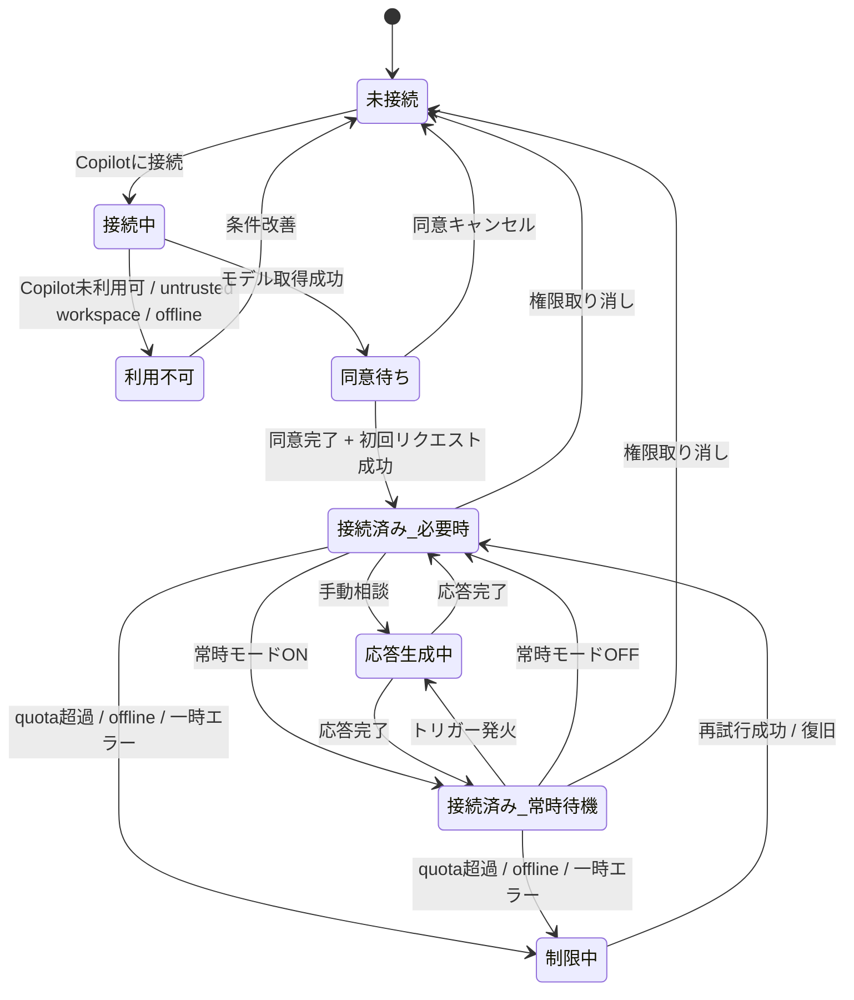

# 06. 状態遷移

## 状態遷移図

## 画面と状態の対応

| 状態 | 表示画面 |
|---|---|
| 未接続 | S01 初回接続画面 |
| 接続中 / 同意待ち | S01 のローディング / 確認状態 |
| 接続済み_必要時 | S02 メイン画面 |
| 接続済み_常時待機 | S02 メイン画面 |
| 応答生成中 | S02 上でストリーミング表示 |
| 制限中 / 利用不可 | S07 制限・エラー画面 |
