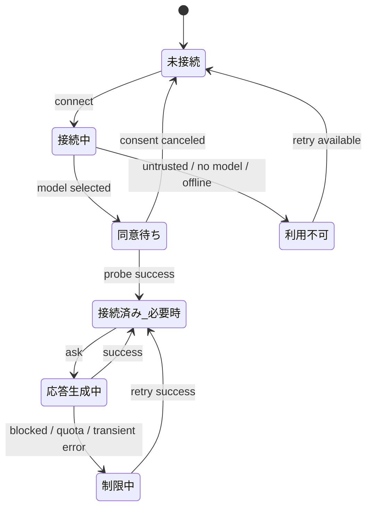

# 09. Phase 1 実装設計

## 目的

本書は、`docs/08-backend-definition.md` で定義した Phase 1 を、実装着手できる粒度まで具体化するための設計書である。  
対象は以下の 4 領域とする。

- 接続管理
- 手動相談フロー
- 基本的な文脈収集
- 画面状態の ViewModel 化

## Phase 1 の完了定義

Phase 1 完了時点では、以下が成立していることを目標とする。

1. サイドバー表示時に、接続前後で適切な画面状態を描画できる
2. `Copilot に接続` から接続成功 / 失敗 / 同意キャンセルを正しく扱える
3. 手動相談で、現在の基本文脈を含んだ AI 助言をサイドバー内に表示できる
4. UI は Controller から受け取る ViewModel のみを描画し、業務ロジックを持たない
5. 将来の Phase 2 以降に耐える責務分割になっている

## Phase 1 のスコープ

### 実装するもの

- S01 初回接続画面の最小実装
- S02 メイン画面の最小実装
- S07 制限・エラー画面の最小実装
- 接続状態管理
- 手動相談
- 基本文脈収集
- 最新アドバイス表示
- 画面用 ViewModel の導入
- Webview の再描画を行う状態変更通知

### Phase 1 では実装しないもの

- 常時モードの自動発話
- 会話履歴
- 深掘り質問
- アドバイス詳細画面
- 送信範囲確認画面
- 設定画面
- SQLite ナレッジ保存
- related symbols / recent edits / workspace-wide 探索

## 設計上の判断

### 9.1 画面は 1 つの Webview で持つ

Phase 1 では、実画面を複数 Webview に分けず、単一の `WebviewView` 内で `screen` に応じて描き分ける。  
これにより、S01 / S02 / S07 を同じ ViewProvider のまま扱える。

### 9.2 常時モードは UI 上で無効化する

`always` は型として保持してもよいが、Phase 1 では有効化しない。  
接続後も `manual` 固定で扱い、UI 上では「Phase 3 で有効化予定」と分かる形で無効表示する。

### 9.3 AI 応答は Information Message ではなく Webview に表示する

現状は `showInformationMessage` で助言を表示しているが、これは S02 の仕様と合わない。  
Phase 1 では「最新アドバイスカード」を Webview 内に描画し、Controller がその内容を状態として保持する。

### 9.4 ContextCollector は Preview と Guidance で責務を分ける

UI 表示用の軽量データと、AI 送信用の文脈データは分ける。

- `collectPreview()`: UI 表示向け
- `collectGuidanceContext()`: AI 送信向け

この分離により、今後の送信計画導入時にも破綻しにくくする。

## Phase 1 の対象ユーザーフロー

### 9.5 初回表示

1. 拡張が activate される
2. Controller が初期状態を組み立てる
3. Webview は `screen=onboarding` を描画する
4. 接続状態、利用条件、送信対象の最小要約を表示する

### 9.6 接続フロー

1. ユーザーが `Copilot に接続` を押す
2. Controller が接続開始中状態へ更新する
3. `ConnectionService` が Trusted Workspace 判定、モデル選択、probe 実行を行う
4. 成功時は `screen=main` に遷移する
5. 失敗時は `screen=error` または `screen=onboarding` に戻し、理由を表示する

### 9.7 手動相談フロー

1. ユーザーが `ガイダンスを求める` を押す
2. Controller が `ContextCollector.collectGuidanceContext()` を呼ぶ
3. `AdviceService` が学習支援用プロンプトを組み立てて送信する
4. 応答完了後、最新アドバイスを SessionStore に保存する
5. Webview が再描画され、S02 上に最新アドバイスカードが表示される

### 9.8 制限・エラーからの復帰

1. 接続失敗または相談失敗時に、Controller がエラー種別を正規化する
2. `screen=error` または画面上部バナーを表示する
3. ユーザーが `再試行` または `Copilot に接続` を押す
4. 成功すれば `screen=main` に戻る

## Phase 1 の状態モデル

Phase 1 では、最終仕様の一部のみを先に実装する。



### 9.9 画面状態

Phase 1 で使う画面状態は以下とする。

| screen | 用途 |
|---|---|
| `onboarding` | 未接続、接続中、同意待ち |
| `main` | 接続済み、手動相談利用可能 |
| `error` | 利用不可、制限中 |

### 9.10 実行状態

接続状態とは別に、UI のボタン制御用として `requestState` を持つ。

| requestState | 意味 |
|---|---|
| `idle` | 実行中でない |
| `connecting` | 接続処理中 |
| `requesting_guidance` | ガイダンス生成中 |

## 型設計

Phase 1 では、まず `src/shared/types.ts` に必要最低限の共通型を追加する。

```ts
export type NavigatorScreen = "onboarding" | "main" | "error";

export type RequestState = "idle" | "connecting" | "requesting_guidance";

export interface DiagnosticSummary {
  severity: "Error" | "Warning" | "Information" | "Hint";
  message: string;
  source?: string;
  line: number;
}

export interface NavigatorContextPreview {
  activeFilePath?: string;
  selectedTextPreview?: string;
  diagnosticsSummary: DiagnosticSummary[];
}

export interface GuidanceContext {
  activeFilePath?: string;
  activeFileLanguage?: string;
  activeFileExcerpt?: string;
  selectedText?: string;
  diagnosticsSummary: DiagnosticSummary[];
}

export interface GuidanceCard {
  requestedAt: string;
  mode: AdviceMode;
  text: string;
  basedOn: NavigatorContextPreview;
}

export interface NavigatorStatusMessage {
  kind: "info" | "warning" | "error";
  text: string;
}

export interface NavigatorSessionState {
  screen: NavigatorScreen;
  connectionState: ConnectionState;
  requestState: RequestState;
  mode: AdviceMode;
  statusMessage?: NavigatorStatusMessage;
  contextPreview: NavigatorContextPreview;
  latestGuidance?: GuidanceCard;
}

export interface NavigatorViewModel {
  screen: NavigatorScreen;
  connectionState: ConnectionState;
  mode: AdviceMode;
  canConnect: boolean;
  canAskForGuidance: boolean;
  canSwitchMode: boolean;
  isBusy: boolean;
  statusMessage?: NavigatorStatusMessage;
  contextPreview: NavigatorContextPreview;
  latestGuidance?: GuidanceCard;
}
```

### 型設計の意図

- `NavigatorSessionState` は内部状態
- `NavigatorViewModel` は描画専用
- `GuidanceContext` は AI 送信専用
- `NavigatorContextPreview` は UI 表示専用

## モジュール構成

Phase 1 の時点で、現在の `CopilotService` の責務を分割する。

### 9.11 `ConnectionService`

責務:

- 接続状態の保持
- `connect()` の実行
- モデル取得
- probe 実行
- 接続エラー分類

主な公開メソッド:

- `getState(): ConnectionState`
- `getModel(): vscode.LanguageModelChat | undefined`
- `connect(): Promise<ConnectionState>`

備考:

- `LanguageModelChat` の保持は `ConnectionService` に寄せる
- 接続開始中の多重実行を内部で防ぐ

### 9.12 `AdviceService`

責務:

- 手動相談用プロンプト生成
- `ConnectionService` が保持するモデルで送信
- 応答文字列の生成
- 相談失敗時のエラー分類

主な公開メソッド:

- `requestManualGuidance(context: GuidanceContext): Promise<string>`

備考:

- Phase 1 では手動相談のみ扱う
- knowledge はまだ利用しない

### 9.13 `ContextCollector`

責務:

- UI 表示用 Preview の収集
- AI 送信用 GuidanceContext の収集

主な公開メソッド:

- `collectPreview(): NavigatorContextPreview`
- `collectGuidanceContext(): GuidanceContext`

Phase 1 で収集する要素:

- active file path
- active file excerpt
- selected text
- diagnostics

Phase 1 で収集しない要素:

- related symbols
- recent edits
- workspace file graph
- definitions / references

### 9.14 `SessionStore`

新規導入する。責務は以下とする。

- 内部状態の一元保持
- 状態更新
- 状態変更イベント通知

主な公開メソッド:

- `getState(): NavigatorSessionState`
- `patch(partial: Partial<NavigatorSessionState>): void`
- `resetStatusMessage(): void`
- `onDidChangeState: Event<NavigatorSessionState>`

備考:

- `NavigatorViewProvider` は Store を直接参照しない
- Controller が Store を更新し、ViewProvider は Controller から ViewModel を受け取る

### 9.15 `NavigatorController`

責務:

- UI からのアクション受け口
- サービス呼び出しの順序制御
- SessionStore 更新
- ViewModel 生成
- VS Code イベント購読による再描画トリガー

主な公開メソッド:

- `initialize(): Promise<void>`
- `getViewModel(): NavigatorViewModel`
- `connectCopilot(): Promise<void>`
- `askForGuidance(): Promise<void>`
- `onDidChangeState: Event<void>`

Controller が購読するイベント:

- `window.onDidChangeActiveTextEditor`
- `window.onDidChangeTextEditorSelection`
- `languages.onDidChangeDiagnostics`

これらのイベントでは AI 実行は行わず、`contextPreview` の更新と再描画通知のみ行う。

## ViewModel 生成方針

ViewModel は `NavigatorSessionState` から都度導出する。

導出ルール:

- `screen` は `connectionState` と `statusMessage` から決定する
- `canConnect` は `requestState === idle` のときのみ true
- `canAskForGuidance` は `connectionState === connected && requestState === idle`
- `canSwitchMode` は Phase 1 では常に false
- `isBusy` は `requestState !== idle`

画面別に必要な表示は以下とする。

### onboarding

- 接続状態
- 学習支援向け拡張であることの説明
- Trusted Workspace / Copilot 利用可否の前提案内
- 最小の送信対象要約
- 接続ボタン

### main

- 接続状態
- manual 固定モード表示
- 現在の文脈プレビュー
- ガイダンス取得ボタン
- 最新アドバイスカード
- エラーまたは補助メッセージ

### error

- 状態タイトル
- エラー説明
- 推奨アクション
- 再試行ボタン

## 基本文脈収集の詳細

Phase 1 の文脈収集は、まずアクティブエディタに限定する。

### 9.16 Preview 収集

表示用として以下を返す。

- `activeFilePath`
- 選択テキストの先頭数百文字
- diagnostics 最大 5 件

### 9.17 Guidance 用収集

送信用として以下を返す。

- `activeFilePath`
- `document.languageId`
- 選択テキスト全文
- active file excerpt
- diagnostics 最大 5 件

active file excerpt の取得ルール:

1. 選択範囲がある場合は選択範囲を優先する
2. 選択範囲がない場合は visible range を優先する
3. visible range が取れない場合はファイル先頭から一定行数を使う
4. 上限を超える場合は行数または文字数で切り詰める

Phase 1 の上限例:

- 選択テキスト: 最大 4000 文字
- active file excerpt: 最大 8000 文字
- diagnostics: 最大 5 件

## エラー正規化方針

Phase 1 では詳細な ErrorMapper はまだ作り込まず、Controller 側または Service 内で以下へ正規化する。

| 条件 | connectionState | screen | 表示方針 |
|---|---|---|---|
| 未接続 | `disconnected` | `onboarding` | 接続を促す |
| 同意キャンセル | `disconnected` | `onboarding` | 再試行案内 |
| untrusted workspace | `unavailable` | `error` | Trust を案内 |
| モデル取得不可 | `unavailable` | `error` | Copilot 利用条件を案内 |
| guidance 失敗 | `restricted` | `error` または `main` | 再試行案内 |

設計上のルール:

- 接続系失敗は `screen=error` へ寄せる
- 手動相談失敗は `latestGuidance` を消さず、画面上部にエラーを出す

## UI 連携方針

`NavigatorViewProvider` は以下に徹する。

- 初回描画
- ViewModel の HTML 化
- ユーザー操作を Controller に渡す
- Controller の状態変更イベントを受けて再描画する

Webview から送るメッセージは Phase 1 では以下のみとする。

- `connect`
- `ask`
- `refresh`

`switchMode` は Phase 1 では送らないか、送っても無効として扱う。

## ファイル単位の変更方針

### 9.18 変更対象

- `src/shared/types.ts`
- `src/application/NavigatorController.ts`
- `src/views/NavigatorViewProvider.ts`
- `src/services/ContextCollector.ts`
- `src/extension.ts`

### 9.19 新規追加

- `src/application/SessionStore.ts`
- `src/services/ConnectionService.ts`
- `src/services/AdviceService.ts`

### 9.20 当面そのままにするもの

- `src/services/KnowledgeStore.ts`

Phase 1 では `KnowledgeStore.initialize()` のみ残し、機能追加はしない。

## 実装順

### Step 1 型を拡張する

- `NavigatorSessionState`
- `NavigatorViewModel`
- `GuidanceContext`
- `GuidanceCard`
- `NavigatorStatusMessage`

### Step 2 SessionStore を入れる

- 初期状態生成
- `patch`
- 状態変更イベント

### Step 3 ConnectionService と AdviceService に分割する

- 既存 `CopilotService` の接続責務を `ConnectionService` へ移す
- 既存 `CopilotService` の prompt / request 責務を `AdviceService` へ移す

### Step 4 ContextCollector を拡張する

- Preview と Guidance の分離
- active file excerpt 取得
- diagnostics の構造化

### Step 5 Controller を再設計する

- SessionStore 更新中心へ変更
- ViewModel 生成追加
- editor / selection / diagnostics 変更時の再描画通知追加

### Step 6 ViewProvider を ViewModel 駆動に置き換える

- `showInformationMessage` をやめる
- `screen` ごとの描画へ変更
- 最新アドバイスカード表示

### Step 7 extension.ts を組み替える

- 新しい service / store を組み立てる
- Controller のイベント購読と dispose を接続する

## 受け入れ条件

### 接続

- 未接続時に onboarding が出る
- 接続成功で main に切り替わる
- 同意キャンセルで onboarding に戻る
- untrusted workspace で error が出る

### 手動相談

- 接続済みでのみ `ガイダンスを求める` が有効
- 押下中はボタンが無効化される
- 応答完了後に Webview 内へ助言が表示される
- 失敗時は前回助言を残したままエラーメッセージが表示される

### 文脈

- active file path が表示される
- 選択テキストが preview に反映される
- diagnostics が更新されると preview も更新される

### 設計

- ViewProvider は Copilot API を直接触らない
- Controller は HTML を生成しない
- AI 応答の生成責務は AdviceService に閉じる

## Phase 1 実装後に残る課題

- 会話履歴の導入
- 根拠一覧の構造化
- 送信範囲確認画面
- 設定永続化
- 常時モードのトリガー制御
- SQLite ナレッジ保存

## 現在コードからの主な変更点

- `CopilotService` 1 クラス集中をやめる
- `NavigatorController` を単純な橋渡しから状態オーケストレータへ変える
- Webview を「状態を表示する画面」に寄せる
- 文脈収集を UI 用 / AI 用で分割する
