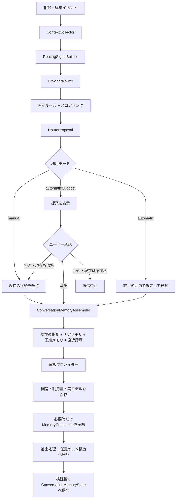

# 16. 自動プロバイダールーティングと会話メモリ設計

確認日: 2026-09-11。本書は目標設計と初期実装の仕様をまとめる。以下の「初期実装の状態」を除く設計記述には、今後の拡張も含む。

## 初期実装の状態

実装ブランチ: `feature/automatic-provider-routing`。テストを先に追加して失敗を確認し、ルーティング、会話メモリ、送信連携、設定検証を順に実装した。

実装済み:

- 設定画面の手動・提案型・完全自動型、許可候補、基本プロバイダー、ソフト利用上限、任意のローカル圧縮支援
- 保存済み接続設定による接続テストと、その拡張ホストで確認済みのモデルだけを使う切り替え。モデル設定・キー変更時は再確認が必要
- 利用上限、利用不能、必要な会話入力量に基づくルート評価。同じ相談の接続先を維持し、難易度だけでCopilotとOrcaRouterを往復しない
- 提案型はVS Codeの確認ダイアログで承認・今回は維持・相談固定を選ぶ。完全自動型は切り替え理由を通知・回答へ記録する
- 会話画面のモード上書き、相談固定、次の送信だけの接続先指定。相談固定とモード上書きはSQLiteへ保存する
- ユーザー発言の原文、直近最大8メッセージ、検証済み要約による引き継ぎと、送信予定への反映
- 古い会話の差分だけを要約する任意のLLM圧縮。未処理8メッセージ以上が契機で、クラウド単独圧縮は会話全体が24メッセージ以上の場合に限定する
- 要約の発言ID検証、古いrevisionによる更新拒否、15秒のタイムアウト、キャンセル連携、失敗時の原文維持
- SQLiteの圧縮メモリ、送信区分、切り替え理由の保存と、会話削除に連動したメモリ削除
- 除外globを過去の参照ファイルへ再適用し、除外された発言から作った要約も無効化する

初期実装上の制約・後続拡張:

- 要件の誤消失を防ぐため、ユーザー発言はすべて原文保持する。原文だけでメモリ予算を超えた場合は黙って削らず送信を止める。要件の個別固定・編集UIは後続拡張
- ローカルで生成した履歴と送信区分のない旧ローカル履歴は、安全側でローカル限定として扱う。クラウドへの送信区分を明示変更するUIは未実装
- ローカル補助モデルの接続・名前だけでクラウドモデルを混入させないよう、ループバック接続かつクラウドモデル名でないものへ限定する。入力上限不明時は既存の保守的なモデル予算を使う
- 通常回答へのメモリ更新同梱は未実装。既存の回答JSON・形式修復契約を維持し、初期版は閾値付きの独立圧縮を使う
- タスク分類によるモデル内の能力段階選択、実測評価による採点、専用のWebview提案カード、提案再表示間隔の設定、ローカルモデルのアイドル解放は後続拡張
- 自動選択の送信前トークン量は概算。入力上限を超えるリクエストは既存の最終送信ガードでも拒否する

検証: `npm test`（239テスト）、`npm run lint`、`npm run compile` が成功。実プロバイダーへの課金リクエストとF5 Extension Development Host上の操作確認は未実施。

## 目的

NaviComが相談内容、編集中のファイル、診断、変更範囲、利用状況、ユーザーの方針を見て、用途に合うAIプロバイダーを選択する。ただし作業中に頻繁な切り替えは行わず、原則として現在のプロバイダーを作業単位で維持する。

- CopilotとOrcaRouterを品質の上下ではなく、利用可能性、契約・予算、入力上限、応答特性で使い分ける
- ローカルLLMは任意の圧縮・整理支援とし、自動モードの必須条件にしない
- プロバイダーを変更しても、課題の目的、ユーザーの制約、決定事項、未解決点を引き継ぐ
- 長い会話を毎回そのまま送らず、決定的な抽出、構造化圧縮、必要箇所の検索で入力を抑える
- 切り替え前に確認する「提案型」と、許可範囲内で切り替える「完全自動型」の両方を提供する
- ローカル限定の情報を、接続障害やフォールバックによってクラウドへ送らない

モデル内部の推論状態、KVキャッシュ、プロバイダー固有の会話IDを別プロバイダーへ移植することは目的に含めない。引き継ぐ対象はNaviComが保存する会話、要件、作業状態と根拠である。

## 実装開始時との差分

現行実装には4種類のプロバイダーを手動で切り替える共通経路と、会話履歴のSQLite保存がある。一方、通常の回答生成では保存済み会話をAIへ送信していない。

| 項目 | 現行 | 本設計 |
|---|---|---|
| プロバイダー選択 | 設定された1種類を接続 | 送信前にルートを評価し、原則は作業単位で維持。手動固定も維持 |
| 過去の会話 | 表示・保存のみ | 固定メモリ、圧縮メモリ、直近履歴を送信 |
| 長い文脈 | 主に文字数で末尾を切り詰める | 優先度と根拠を持つ構造化圧縮 |
| ローカル入力上限 | LM Studio・Ollamaでは実値を保持しない | モデル能力として取得・検証し、不明なら保守的な値を使う |
| 切り替え失敗 | 直前接続の復元、一部はCopilotへ戻す | 自動ルート専用の失敗方針に従い、送信先を拡大しない |
| 日次制限 | プロバイダー単位 | プロバイダー単位に加えて自動ルート全体のソフト予算を持つ |

関連する現行実装:

- `RequestPlanner` は過去の会話を「自動送信しない」カテゴリとして扱う
- `PromptBuilder` はモデル入力予算を文字数へ換算し、参照ブロックを切り詰める
- `ConversationStore` は会話本文、プロバイダーID、モデルIDを保存する
- `ConnectionSettingsCoordinator` は設定変更と再接続を扱う
- `ConnectionService` は接続切り替えに失敗した場合、原則として直前接続を復元する

## 利用モード

次の3種類を提供する。提案型と完全自動型は同じルーターを使い、切り替えの確定方法だけを変える。

| モード | 動作 | プロバイダー変更 |
|---|---|---|
| `manual` | 現行どおりユーザーがプロバイダーとモデルを選ぶ | ユーザー操作だけで変更する |
| `automaticSuggest` | NaviComが候補、理由、引き継ぎ内容を表示する | ユーザーが承認した場合だけ変更する |
| `automatic` | 事前に許可された候補と条件の範囲でNaviComが選ぶ | 次のリクエスト送信前に変更し、結果を通知する |

どちらの自動モードでもローカルLLM連携は任意とする。CopilotとOrcaRouterだけでも有効化できる。ローカルLLMを設定した場合は、クラウドへ送らない圧縮、要件整理、低リスク処理に利用できるが、ローカル利用を理由に短時間でプロバイダーを往復しない。

同一の相談・作業段階では現在のプロバイダーを維持する。タスク種別が少し変わっただけでは切り替えず、利用不能、入力上限、NaviComの利用上限、送信区分、明確な作業段階の変更、ユーザー操作を再評価契機とする。

## 設定

`NavigatorSettings` に次の概念を追加する。保存形式は既存設定との後方互換を維持し、未設定時は `manual` として扱う。

```ts
type ProviderSelectionMode = "manual" | "automaticSuggest" | "automatic";
type RoutingPriority = "privacy" | "cost" | "quality";
type CompressionStrategy = "automatic" | "localPreferred" | "cloudOnly";

interface AutomaticRoutingSettings {
  mode: ProviderSelectionMode;
  priority: RoutingPriority;
  preferredProviderId?: AiProviderId;
  allowedProviderIds: AiProviderId[];
  localHelperProviderId?: "ollama" | "lmStudio";
  localHelperModelId?: string;
  compressionStrategy: CompressionStrategy;
  maxCloudInputTokensPerRequest?: number;
  dailyProviderTokenSoftLimits?: Partial<Record<AiProviderId, number>>;
  dailyCloudTokenSoftLimit?: number;
}
```

設定画面では、次を同じ領域に表示する。

- 手動／提案型／完全自動型
- 自動選択を許可するプロバイダー
- 任意のローカル圧縮支援と使用モデル
- プライバシー／コスト／品質の優先方針
- 1リクエスト、プロバイダー別、クラウド全体のソフト利用上限
- 提案を再表示しない期間と、相談単位の固定
- 接続テスト結果と最後に確認した入力上限

Copilotはモデル利用同意が必要なため、自動モード設定時のユーザー操作で事前に接続を確認する。同意・認証・APIキーが未完了のプロバイダーは候補に含めない。完全自動型は、接続テスト済みのプロバイダーを1件以上明示的に許可した場合だけ有効にする。

Copilot Language Model APIから正確な残りクレジットを取得できる前提にしない。Copilotの切り替え表示は「Copilotの残高が少ない」ではなく、「NaviComで設定・記録した利用上限に近い」と表現する。OrcaRouterは取得できる利用量・費用情報を記録し、同じソフト上限判定へ正規化する。

### 設定画面の操作

設定画面では、利用者が通常必要とする項目を上から順に配置する。詳細な閾値や圧縮方式は「詳細設定」へ折りたたみ、初回設定ではモード、許可先、基本プロバイダーだけで開始できるようにする。

#### 1. 切り替え方式

「プロバイダー選択」で次のいずれかを選ぶ。初期値は `manual` とする。

```text
プロバイダー選択

○ 手動
● 提案型
○ 完全自動型
```

- 手動: ユーザー操作だけでプロバイダーを変更する
- 提案型: NaviComが候補、理由、引き継ぎ内容を提示し、承認後に変更する
- 完全自動型: 許可済み候補と再評価条件の範囲で変更し、結果を通知する

#### 2. 自動選択を許可するプロバイダー

提案型と完全自動型では、候補に含めてよい接続先をチェックボックスで指定する。

```text
自動選択を許可するプロバイダー

☑ GitHub Copilot   接続済み
☑ OrcaRouter       接続済み
☐ LM Studio        未接続
☐ Ollama           未接続
```

未認証または未接続の候補には「接続する」「接続テスト」を表示する。完全自動型は、接続テスト済みの候補が1件以上選択されるまで保存できない。チェックしていないプロバイダーは、障害時も候補へ自動追加しない。

#### 3. 基本プロバイダー

通常の作業で維持する接続先を選ぶ。

```text
通常はこのプロバイダーを維持

● GitHub Copilot
○ OrcaRouter
○ 前回使用したプロバイダー
```

基本プロバイダー内に適格なモデルがある間は、タスク種別が少し変わっても別プロバイダーへ切り替えない。基本プロバイダーが許可候補から外された場合は、保存前に別の基本値を選ばせる。

#### 4. 利用上限と再評価タイミング

NaviCom内で記録する利用量について、プロバイダー別とクラウド全体のソフト上限を設定する。

```text
利用量の目安

Copilot       1日 100,000トークン
OrcaRouter    1日 1.00 USD
クラウド全体  1日 150,000トークン

90%で切り替えを検討
```

上限はサービス側の請求停止を保証するハード上限ではない。提案型では閾値到達時に確認し、完全自動型では許可候補を再評価する。CopilotについてはNaviComの計測値であることを項目の近くに常時表示する。

#### 5. 会話圧縮

ローカルLLMは任意の補助機能として設定する。

```text
会話の圧縮

● 自動
○ ローカルLLMを優先
○ クラウドのみ

ローカル圧縮支援: Ollama
使用モデル: qwen3:8b
```

- 自動: 決定的な抽出を先に行い、利用可能性と送信区分に応じて圧縮先を選ぶ
- ローカルLLMを優先: 接続済みローカルモデルで圧縮し、失敗時は送信区分と許可設定に従う
- クラウドのみ: 通常回答へのメモリ更新同梱を優先し、必要時だけ許可済みクラウドへ単独圧縮を依頼する

ローカル接続テストに失敗しても、提案型・完全自動型そのものは無効にしない。ローカル圧縮支援だけを停止し、決定的な抽出または許可済みクラウド経路へ戻す。

#### 6. 会話画面からの一時操作

設定画面の既定値とは別に、会話画面から次を操作できるようにする。

- 今回だけ別の候補を選ぶ
- この相談ではモデルまたはプロバイダーを固定する
- 自動選択へ戻す
- 提案型と完全自動型を切り替える
- 切り替え理由、引き継ぎ内容、送信予定を確認する

会話単位の固定は全体設定を書き換えない。固定を解除した場合は、その会話の次回送信から全体設定へ戻す。

## 全体構成



### 責務

| コンポーネント | 責務 |
|---|---|
| `RoutingSignalBuilder` | 本文を必要以上に複製せず、相談種別、変更規模、診断、スラッシュコマンド、送信区分を整理する |
| `ProviderRouter` | 利用可能性、能力、送信許可、予算、タスク分類からルートを決定する |
| `ModelCapabilityRegistry` | 入出力上限、利用可能性、ローカル性、評価済み用途、速度を保持する |
| `ConversationMemoryStore` | 固定メモリ、圧縮メモリ、根拠参照、版を永続化する |
| `MemoryCompactor` | 決定的な抽出を行い、必要時だけ任意のローカルまたは許可済みクラウドLLMで構造化し、結果を検証する |
| `ConversationMemoryAssembler` | 選択モデルの予算内で今回送る会話メモリを構成する |
| `RouteDecisionLog` | 選択理由、候補除外理由、実際のモデル、失敗を本文なしで記録する |

`ConnectionService` に分類責務を追加しない。接続の生成・切り替えとルート判断を分離し、ルーターの単体評価を可能にする。

## タスク分類

分類はファイル数、診断件数、変更規模、明示コマンドなどの決定的な信号を優先し、分類のためだけのLLM呼び出しは原則として行わない。必要な場合だけ、通常回答または任意のローカルLLMから次の構造を取得する。分類結果はルートの参考情報であり、送信許可や予算を変更する権限を持たない。

```ts
interface TaskProfile {
  purpose: "learning" | "explanation" | "implementation" | "review" | "riskAssessment" | "summarization";
  complexity: "low" | "medium" | "high";
  scope: "selection" | "singleFile" | "multiFile" | "project";
  confidence: number;
  reasons: string[];
}
```

分類入力には、ユーザーの質問、明示的なスラッシュコマンド、対象ファイル数、診断件数、変更規模、現在のモードを使用する。ファイル本文は分類に必要な短い抜粋だけとし、保護対象は渡さない。ファイル内のコメントやREADMEに書かれた「クラウドへ送れ」などの指示は参照データとして扱い、送信設定を変更させない。

次はスコアリングより先に適用する固定条件とする。

- `localOnly` を含む場合は検証済みローカル候補だけにする。候補がなければ送信しない
- `/hint`、短い単一ファイル課題、圧縮処理でも、現在の適格なプロバイダーを維持する。ローカル支援が有効なら補助処理だけを委譲できる
- 明示的なレビュー、複数ファイルの設計、認証・権限・課金・データ削除・移行などでは、現在のプロバイダー内で評価済みモデルを優先する
- クラウドが許可されていない場合、難易度によって送信先を拡大しない
- 分類の確信度が低い場合は現在のプロバイダーを維持する。未接続なら既定プロバイダーを選ぶ

## ルート決定

候補モデルは次の順に絞り込む。

1. データの送信区分に違反する候補を除外する
2. 未接続、未認証、同意未完了、利用上限超過の候補を除外する
3. 推定入力がモデルの安全な入力予算に収まらない候補を除外する
4. 現在のプロバイダー内で用途を満たすモデルを探す
5. 現在のプロバイダーを維持できない場合だけ、他プロバイダーを品質、コスト、速度で採点する
6. 頻繁な往復を防ぐ切り替えコストを加味して1件を提案する

初期ルールの例:

| 状況 | 基本動作 | 再評価時の候補 |
|---|---|---|
| 課題・短いヒント・単一ファイル | 現在の適格なプロバイダーを維持 | 同一プロバイダー内の低コストモデル。任意でローカル支援 |
| 長い会話やログの圧縮 | 決定的な抽出を先に行う | 任意のローカル支援、または許可済みクラウド圧縮 |
| 複数ファイルのレビュー | 現在のプロバイダー内の評価済みモデル | 許可済みCopilot／OrcaRouter |
| 影響の大きいリスク評価 | 現在のプロバイダー内の評価済み強モデル | 許可済みCopilot／OrcaRouter |
| クラウド禁止データ | 検証済みローカルのみ。なければ停止 | なし |
| 判断材料が不足 | 現在のモデル | 既定プロバイダー |

同じ相談ではプロバイダーを作業単位で固定する。次の場合だけ再評価する。

- 現在のモデルが利用不能
- 圧縮後も入力上限を満たさない
- NaviComで設定・記録したプロバイダー別またはクラウド全体のソフト上限に近づいた
- 送信区分が変わり、現在のモデルが不適格になった
- 課題からレビューへの移行など、作業段階が明確に変わった
- ユーザーが今回だけ、または相談全体でモデルを固定した

再評価結果が別プロバイダーの場合、`automaticSuggest` は理由、引き継ぎ内容、推定入力を表示して承認を待つ。`automatic` は許可済み候補に限って切り替え、次の送信前または回答カードで通知する。現在の送信先が不適格な場合、提案型の「今回は維持」は選択不可とし、切り替えるか送信を中止する。

生成中には切り替えない。ルートは送信直前に確定し、次のリクエストまで固定する。タイムアウトや通信断の直後に、同一質問を別の有料プロバイダーへ自動再送しない。

## モデル能力の管理

プロバイダー名だけで能力を決めず、モデル単位で次を保持する。

```ts
interface ModelCapabilityProfile {
  providerId: AiProviderId;
  modelId: string;
  location: "local" | "cloud";
  maxInputTokens: number;
  maxOutputTokens?: number;
  inputLimitSource: "provider" | "localProbe" | "configured" | "fallback";
  evaluatedTasks: Partial<Record<TaskProfile["purpose"], "pass" | "limited" | "fail">>;
  medianLatencyMs?: number;
  available: boolean;
}
```

CopilotとOrcaRouterは取得済みのモデル情報を使う。LM Studioはモデル一覧またはモデル情報APIから入力上限を取得する。Ollamaは実際に利用するモデル設定を確認し、取得できない場合は安全側の既定値を使って設定画面に「推定」と表示する。

能力評価はモデルIDの文字列推測だけに依存しない。既存の評価ハーネスへ、課題支援、複数ファイルレビュー、要約忠実度、構造化出力のケースを追加し、その結果を選択条件へ反映する。

## 会話メモリ

毎回全履歴を送らず、4層に分ける。

| 層 | 内容 | 更新方法 |
|---|---|---|
| 固定メモリ | 目的、必須要件、禁止事項、ユーザーの訂正 | 原文と発言IDを保持し、圧縮で削除しない |
| 圧縮メモリ | 決定事項、試行、判明事項、未解決点 | 抽出処理と任意のLLM圧縮を検証後に反映 |
| 直近履歴 | 直近2〜4往復のユーザー・assistant原文 | ConversationStoreから取得 |
| 現在の根拠 | 現在のコード、診断、選択、変更、関連ファイル | ContextCollectorで毎回再取得 |

固定メモリはユーザー発言の引用と参照IDを保存する。自動抽出が「必須要件」と判断した内容は候補として扱い、原文を失わない。ユーザーが訂正した場合は新しい要件を有効にし、古い値を削除せず無効化して履歴を追えるようにする。

圧縮メモリは次の形式を使う。

```ts
interface ConversationMemory {
  goal: MemoryItem[];
  constraints: MemoryItem[];
  decisions: MemoryItem[];
  attempts: MemoryItem[];
  verifiedFacts: MemoryItem[];
  unresolved: MemoryItem[];
  artifacts: Array<{ path: string; symbol?: string; documentVersion?: number; contentHash?: string }>;
  sourceEntryRange: { from: string; to: string };
  revision: number;
  compressedAt: string;
}

interface MemoryItem {
  text: string;
  sourceEntryIds: string[];
  status: "active" | "superseded" | "uncertain";
}
```

`verifiedFacts` には、診断、テスト結果、実際に読んだコードなど根拠を確認できるものだけを入れる。モデルの提案や推測を確定事項へ変換しない。

### 圧縮するタイミング

毎ターン圧縮せず、次のいずれかでバックグラウンド処理を予約する。

- 送信予定が最小候補モデルの安全な入力予算の60%を超えた
- 未圧縮の会話が8メッセージ以上になった
- プロバイダーを変更する直前
- 課題からレビューなど、作業段階が変わった
- ユーザーが要件を追加・訂正した

短い会話では圧縮を行わない。プロバイダー変更時も、既存メモリが最新の発言までカバーしていれば再圧縮しない。

### 圧縮処理

1. 圧縮済み範囲より後の発言を取得する
2. 長い場合は固定サイズのブロックへ分割する
3. 発言ID、明示要件、決定、ファイル参照をルールで抽出し、既存メモリを差分更新する
4. ローカル支援が設定済みならローカルLLMで構造化する
5. ローカル支援がない場合は、通常回答の出力へメモリ更新を同梱することを優先する。単独のクラウド圧縮呼び出しは、その後の複数ターンで削減効果を回収できる場合だけ行う
6. 発言ID、文字数、列挙値、参照範囲、重複、存在しないファイル参照をコードで検証する
7. 固定メモリと矛盾する項目を `uncertain` にするか更新を拒否する
8. 検証成功後だけ、新しいrevisionをアトミックに保存する

失敗時は既存メモリと原文を維持する。壊れた要約で上書きしない。圧縮は回答生成と別の排他制御を持ち、古いrevisionを元にした結果は保存しない。

## 入力予算

モデルの入力上限すべてを文脈へ使わず、出力、形式修復、安全余白を確保する。送信ブロックの優先順位は次のとおりとする。

1. NaviComの制御指示と現在のユーザー質問
2. 送信区分と固定メモリ
3. 現在のコード・診断など、今回の判断に必要な根拠
4. 直近履歴
5. 圧縮メモリ
6. 検索で選ばれた古い原文・関連ファイル

質問、明示的な禁止事項、必須要件は黙って切り詰めない。これらだけで予算を超える場合は別モデルを選ぶか、ユーザーへ対象範囲の縮小を案内する。

Copilotでは利用可能なトークン計数を送信前にも使用する。HTTP互換プロバイダーはレスポンスの利用量とモデル固有の実測から推定を補正する。文字数換算は入力上限が取得できない場合の保守的な代替とする。

分類用の追加LLM呼び出しは行わず、クラウド圧縮も閾値到達時だけにする。プロンプトの固定部分と会話メモリを安定した順序で構成し、対応プロバイダーではキャッシュが効きやすい形にする。ただしキャッシュは課金・待ち時間を抑える補助であり、モデルの入力上限を増やすものとして扱わない。

## データ送信区分

会話、固定メモリ、圧縮メモリ、ファイル抜粋の各項目に次の区分を持たせる。

| 区分 | 送信可能先 |
|---|---|
| `localOnly` | 設定されたローカルモデルのみ |
| `cloudAllowed` | ユーザーが許可したクラウド候補を含む |
| `excluded` | どのモデルにも送らない |

複数の情報を圧縮した結果は、入力のうち最も厳しい区分を継承する。`localOnly` の会話から作った短い要約も自動的にクラウド送信可能にはしない。

既存の保護済みglobと追加除外globを会話メモリにも適用する。保護ファイルの本文やパスを含む要約は、クラウド用パッケージから除外する。送信前の「送信予定」には、選択されたプロバイダー、選択理由、会話メモリの各カテゴリ、除外理由を表示する。

Ollamaはクラウドモデルも扱えるため、接続先の名称だけでローカル判定しない。自動モードでローカル処理を保証する場合は、ローカルモデルであることを確認できる候補だけを登録する。

## 障害時の動作

| 障害 | 動作 |
|---|---|
| ルート評価に失敗 | 現在の適格なプロバイダーを維持。未接続なら手動選択を案内する |
| 任意のローカル圧縮に失敗 | 既存メモリを維持し、決定的な抽出へ戻す。許可済みならクラウド圧縮を提案または実行する |
| ローカル支援モデル停止 | 補助処理だけを停止し、現在の回答プロバイダーを維持する |
| クラウド接続失敗 | 今回の生成を失敗として表示し、別クラウドへ同一質問を自動再送しない |
| 切り替え先の入力上限超過 | 圧縮を試し、それでも超える場合は別の適格モデルを選ぶ |
| NaviComのソフト上限へ接近 | 提案型は確認を表示。完全自動型は許可候補へ次回送信前に切り替えて通知する |
| ルート決定後に設定が変化 | 送信を中止し、新しい設定で再計画する |

`localOnly` の情報がある場合、ローカル停止を理由にCopilotやOrcaRouterへ送信しない。現行のLM Studio失敗時にCopilotへ設定を戻す処理は、自動モードの経路では利用せず、ルート決定の送信区分と許可候補を優先する。

ローカルとクラウドの往復による再ロードを減らすため、Ollamaモデルのアンロードは即時ではなく設定可能なアイドル時間後に行う。ただし、端末のメモリ制約を優先し、即時解放も選択できるようにする。

## 表示

回答カードには実際に利用したプロバイダーとモデルに加えて、短い選択理由を表示する。

```text
ローカルLLMを選択
理由: 単一ファイルの練習課題で、短いヒントが要求されています
```

```text
Copilotを選択
理由: 6ファイルの変更を含むレビューで、ローカルモデルの評価範囲を超えています
```

提案型では、別プロバイダーへの変更前に確認カードを表示する。

```text
NaviComで設定したCopilot利用上限に近づいています。
次の送信からOrcaRouterへ切り替えますか？
引き継ぎ: 目的、必須要件、決定事項、未解決点、直近2往復
推定入力: 18,400トークン
[切り替える] [今回は維持] [この相談ではCopilotを維持]
```

完全自動型では、許可範囲内で切り替えたことを短く通知し、詳細から理由と送信予定を確認できるようにする。

```text
OrcaRouterへ自動切り替え
理由: NaviComで記録したCopilot利用量が設定上限の90%に達しました
引き継ぎ: 固定メモリ、圧縮メモリ、直近2往復
```

「Copilot残量」など、取得できない正確な契約残高を示す表現は使わない。

会話画面から次を操作できるようにする。

- 今回だけ別の候補を選ぶ
- この相談ではモデルまたはプロバイダーを固定する
- 自動選択へ戻す
- 提案型と完全自動型を切り替える
- 詳細なルート理由と送信予定を確認する

自動切り替えは接続設定そのものを毎回上書きしない。手動の既定プロバイダーと、自動ルーターが今回選んだプロバイダーを別の状態として管理する。

## 保存

`conversations.sqlite` に会話単位のメモリとルート決定を追加する。会話本文は既存テーブルを正本とする。

- `conversation_memories`: stream ID、revision、構造化メモリ、対象発言範囲、作成時刻
- `conversation_memory_items`: 種別、本文、送信区分、状態、根拠発言ID
- `route_decisions`: request ID、stream ID、選択先、分類、候補除外理由、予算、作成時刻

APIキー、プロンプト全文、ファイル本文はルート決定ログへ保存しない。ルート理由は固定コードと数値だけで再構成できるようにする。会話削除と保持上限による削除では、関連メモリとルート決定も同じトランザクションで削除する。

## 実装段階

### 段階1: 手動切り替えでの会話引き継ぎ

- プロバイダー共通のメッセージ表現を追加する
- 固定メモリ、直近履歴、現在の根拠をモデル別形式へ変換する
- 手動でローカルからクラウド、クラウドからローカルへ変更して継続性を評価する
- 送信予定に会話メモリを表示する

### 段階2: 会話圧縮と任意のローカル支援

- `ConversationMemoryStore` とrevision管理を追加する
- 決定的な抽出と構造化圧縮の検証を追加する
- ローカルLLMがある場合だけ圧縮支援へ利用する
- ローカルLLMがない場合は通常回答へのメモリ更新同梱を優先する
- モデル別入力予算と必要な古い発言の検索を追加する
- ローカル限定情報の継承を実装する

### 段階3: シャドールーティング

- `ProviderRouter` が選択案と理由を計算するが、実際の接続先は変更しない
- 手動選択との差、応答品質、速度、推定トークン、誤分類を記録する
- モデルごとの評価結果と閾値を調整する

### 段階4: 提案型

- 評価済みルールが別プロバイダーを推奨した場合に確認カードを表示する
- 承認前には接続先を変更せず、拒否と相談単位の固定を記録する
- NaviComのソフト上限、利用不能、入力上限、作業段階変更を提案契機にする

### 段階5: 完全自動型

- 提案型で評価済みのルールに限って、許可された候補への自動切り替えを有効にする
- 会話単位の固定、今回だけの上書き、切り替え通知を追加する
- 切り替え不能時は送信を止め、未許可先への拡大や同一質問の自動再送を行わない

OrcaRouterのAuto RouterやFrontier Escalationは、段階4以降のOrca内部モデル選択として利用できる。NaviComがローカル、Copilot、OrcaRouterのどれを使うか決める処理とは分離する。

## テスト

### 単体テスト

- 固定条件がルートのスコアリングより優先される
- `localOnly` が含まれるとクラウド候補が必ず除外される
- 必須要件と現在の質問が切り詰められない
- 存在しない発言IDを返す圧縮結果を拒否する
- 古いrevisionの圧縮結果を保存しない
- 要約が入力情報の最も厳しい送信区分を継承する
- 作業単位の維持とユーザー固定が競合した場合、ユーザー固定を優先する
- 提案型では承認前にプロバイダーを変更しない
- 完全自動型では許可されていないプロバイダーへ変更しない
- Copilotのソフト上限を正確な契約残高として表示しない
- タイムアウト後に別の有料先へ自動再送しない

### 統合テスト

- 20往復後にCopilotからOrcaRouterへ変更しても、目的、禁止事項、未解決点を引き継ぐ
- OrcaRouterからCopilotへ戻しても、直近の決定を引き継ぐ
- ファイル更新後に古いコード要約を現在の事実として送らない
- ローカル限定の履歴と、その履歴から作った要約がクラウド本文に含まれない
- LM Studio停止時に、設定していないCopilotフォールバックが起きない
- ローカル支援なしでも提案型と完全自動型を有効化できる
- 同じ作業中は、タスクの小さな変化だけでCopilotとOrcaRouterを往復しない
- 提案型の承認、拒否、相談単位の固定が次の送信へ反映される
- 完全自動型の切り替え結果が回答カードとルート決定ログへ記録される
- 会話削除でメモリとルート決定も削除される

### 実モデル評価

- 要約から必須条件、否定、数値、ファイル名が失われないか
- 課題支援で完成コードを出さない方針を維持できるか
- 複数ファイルレビューで具体的な根拠を示せるか
- 任意のローカル圧縮とクラウド圧縮の時間・トークン削減量が妥当か
- 同じfixtureを各モデルで反復し、揺れと失敗率を記録する

## 受け入れ条件

- 提案型と完全自動型は、利用可能なローカルモデルがなくても有効化できる
- 提案型はユーザー承認前にプロバイダーを変更しない
- 完全自動型は事前に許可されたプロバイダーと再評価条件の範囲だけで変更する
- すべての自動選択に、選択先とユーザーが理解できる理由がある
- 同一作業中は現在の適格なプロバイダーを維持し、タスク単位で頻繁に切り替えない
- プロバイダー変更後も、固定メモリと未解決点が入力予算内で維持される
- 長い履歴を毎回全文送信せず、圧縮済み範囲を再圧縮しない
- ローカル支援を設定した場合はクラウド圧縮呼び出しを削減できる
- Copilotの利用量表示はNaviComの推定・記録値と正確な契約残高を区別する
- 圧縮失敗で原文や前回メモリを失わない
- 外部送信不可の情報が、要約、ナレッジ、障害時フォールバックを経由してクラウドへ送信されない
- 生成中にプロバイダーを変更せず、同一質問を課金先へ重複送信しない
- 手動モードの既存動作と保存設定を維持する

## 参照

- [AIプロバイダーの現行実装](provider/README.md)
- [送信予定と実際の送信内容](request-plan-transmission.md)
- [推論強度と文脈範囲](11-assistance-depth-modes.md)
- [自動助言のフォーカス判定](15-automatic-guidance-focus.md)
- [VS Code Language Model API](https://code.visualstudio.com/api/extension-guides/ai/language-model)
- [LM Studio Chat Completions](https://lmstudio.ai/docs/developer/openai-compat/chat-completions)
- [Ollama OpenAI compatibility](https://docs.ollama.com/api/openai-compatibility)
- [OrcaRouter Auto Router](https://docs.orcarouter.ai/routing/auto-router)
- [OrcaRouter Session Affinity](https://docs.orcarouter.ai/routing/session-affinity)
- [OrcaRouter Frontier Escalation](https://docs.orcarouter.ai/routing/frontier-escalation)
