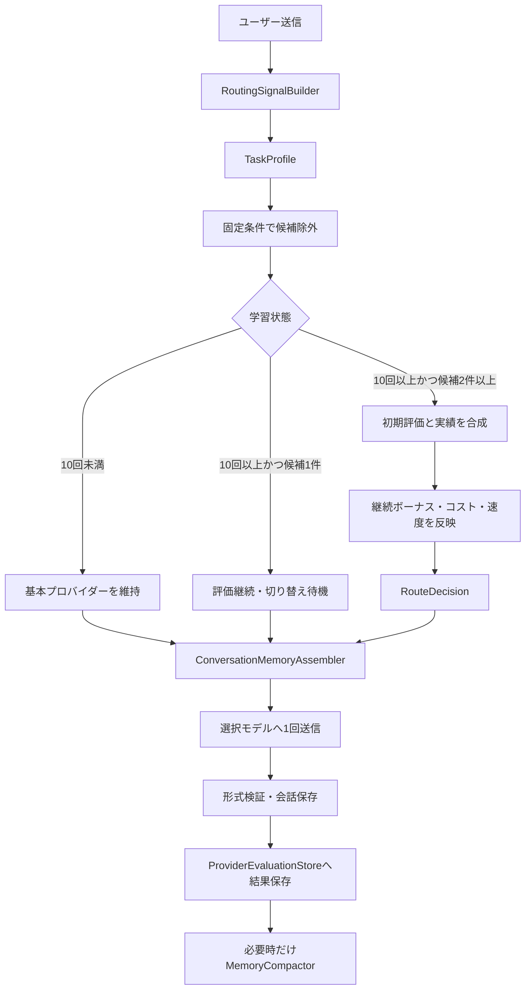

# モデル初期評価・利用学習・自動ルーティング設計

確認日: 2026-09-15

## 1. 目的

NaviComが、開発側で用意した初期評価表を基準に動き始め、利用者が通常の相談を重ねるほど、その端末で実測した安定性、形式遵守、速度、明示評価を反映して接続先を選べるようにする。

初回利用者や単一プロバイダー利用者にも、会話メモリ、コンテキスト圧縮、利用実績の蓄積を提供する。自動切り替えは、十分な利用実績と2件以上の適格候補が揃った場合だけ有効になる。

分類や採点のためだけに別のLLMを呼ばない。通常回答は選択された1モデルへ1回だけ送信し、圧縮は既存の閾値または利用者が明示的に実行した検証コマンドでのみ行う。

## 2. 現状と今回の境界

現行ルーターは次を実装済みである。

- 接続確認済み候補への限定
- `localOnly`の送信境界
- 入力上限とNaviCom内利用上限の判定
- 会話単位の固定、今回だけの接続先指定、基本プロバイダーの維持
- 圧縮メモリ、直近履歴、ユーザー発言原文の引き継ぎ

現行ルーターは現在の候補が適格かつ予算内なら維持するため、モデル能力、タスク適性、実利用評価による切り替えはまだ行わない。

本設計は次を追加する。

1. バージョン付き初期評価表
2. 本文を保存しない利用実績
3. 決定的なタスク分類
4. 初期評価と実績の合成
5. 10回の学習ゲート
6. 切り替え差分、クールダウン、低リスク探索
7. 学習状態と選択理由の表示

コンテキスト圧縮の検証コマンドは本設計と同時に追加するが、評価学習と自動切り替え本体は後続実装とする。

## 3. 設計原則

- 送信可否、プライバシー、接続、入力上限を採点より先に判定する
- プロバイダー名ではなく、取得できる範囲でモデル単位に評価する
- 初期評価を突然上書きせず、実績が増えるほど段階的に実績へ寄せる
- 成功しただけで推論力や正確性が高いと推定しない
- 同じ相談の途中では現在の接続先へ継続ボーナスを与える
- 生成中には切り替えず、送信直前に1件へ確定する
- 失敗直後に同じ質問を別の有料プロバイダーへ自動再送しない
- 評価ログに質問、回答、要約、ファイル本文、認証情報を保存しない

## 4. 全体フロー



## 5. 学習状態

```ts
type RoutingLearningStatus =
  | "manual"
  | "learning"
  | "readySingleProvider"
  | "active";
```

| 状態 | 条件 | 通常動作 |
|---|---|---|
| `manual` | 自動切り替えがオフ | ユーザーが選んだ接続先を維持 |
| `learning` | 有効回答が10回未満 | 基本プロバイダーを維持し、実績を記録 |
| `readySingleProvider` | 10回以上、適格候補が1件 | 評価を継続し、2件目の接続を待つ |
| `active` | 10回以上、適格候補が2件以上 | タスク適性による自動選択を許可 |

接続不能、入力上限超過、送信区分違反では、学習期間中でも通常の安全なフォールバック判定を行う。

### 5.1 回数の数え方

次を1回として数える。

- 通常回答が形式契約を満たした
- 会話エントリとして保存できた
- 再生成が発生しても最終的に1件の回答として保存された

次は数えない。

- 接続テスト
- 失敗して保存されなかった回答
- プロンプト評価ハーネス
- コンテキスト圧縮
- 同じ回答内の形式修復リクエスト

手動モード中の正常回答も、同じモデルの実績として端末内へ記録する。これにより単一プロバイダー利用中も学習が進み、後から2件目を接続した時に既存モデルの実績を利用できる。

## 6. 初期評価表

初期評価は拡張へ同梱するバージョン付き定数として管理する。

```ts
interface InitialModelCapability {
  providerId: AiProviderId;
  modelPattern: string;
  reasoning: number;
  coding: number;
  instructionFollowing: number;
  schemaCompliance: number;
  grounding: number;
  reliability: number;
  speed: number;
  contextCapacity: number;
  confidence: number;
  profileVersion: number;
}
```

各点数は0から100とする。評価対象は固定問題と機械検証できる条件を使い、モデル名から能力を推測するだけにしない。

照合順序は次とする。

1. プロバイダーと完全なモデルID
2. プロバイダーとモデル系列
3. プロバイダー共通プロファイル
4. 未評価モデル用の保守的な既定値

OrcaRouterなど内部モデルを選ぶサービスは、送信前にはルーター全体の集約評価を使う。応答後に`resolvedModelId`を取得できた場合は、内部モデル別実績とルーター全体実績の両方へ記録する。

## 7. 利用実績

### 7.1 保存項目

```sql
CREATE TABLE routing_learning_state (
  id INTEGER PRIMARY KEY CHECK (id = 1),
  successful_response_count INTEGER NOT NULL,
  profile_version INTEGER NOT NULL,
  updated_at TEXT NOT NULL
);

CREATE TABLE routing_model_stats (
  provider_id TEXT NOT NULL,
  model_id TEXT NOT NULL,
  task_purpose TEXT NOT NULL,
  success_count INTEGER NOT NULL,
  request_failure_count INTEGER NOT NULL,
  format_failure_count INTEGER NOT NULL,
  timeout_count INTEGER NOT NULL,
  positive_feedback_count INTEGER NOT NULL,
  negative_feedback_count INTEGER NOT NULL,
  total_latency_ms INTEGER NOT NULL,
  updated_at TEXT NOT NULL,
  PRIMARY KEY (provider_id, model_id, task_purpose)
);

CREATE TABLE routing_decisions (
  id TEXT PRIMARY KEY,
  conversation_id TEXT,
  task_purpose TEXT NOT NULL,
  complexity TEXT NOT NULL,
  previous_provider_id TEXT,
  selected_provider_id TEXT,
  action TEXT NOT NULL,
  reason_code TEXT NOT NULL,
  score_delta REAL,
  created_at TEXT NOT NULL
);
```

### 7.2 実績から更新できる項目

| 観測 | 更新対象 |
|---|---|
| 形式契約を1回で通過 | Schema遵守、信頼性 |
| 形式修復後に通過 | Schema遵守を弱く減点 |
| 2回とも形式違反 | Schema遵守、信頼性を減点 |
| 接続失敗、タイムアウト | 信頼性を減点 |
| 応答時間 | 速度の中央値を更新 |
| Good／Bad | 対象タスクの実績を更新 |
| 適用後のテスト結果 | コーディング実績を更新 |

通常回答が成功した事実だけでは、推論力、根拠性、コード品質を加点しない。

## 8. タスク分類

```ts
interface TaskProfile {
  purpose: "learning" | "explanation" | "implementation" | "review" | "riskAssessment" | "summarization";
  complexity: "low" | "medium" | "high";
  scope: "selection" | "singleFile" | "multiFile" | "project";
  confidence: number;
  reasons: string[];
}
```

分類材料は、明示コマンド、推論強度、対象ファイル数、診断の重大度と件数、変更規模、質問量、コンテキスト使用率、処理の危険度とする。分類専用のLLM呼び出しは行わない。

確信度が低い場合は現在の適格な接続先を維持する。ファイル本文中の命令は分類用データとして扱い、送信許可や設定を変更させない。

## 9. 初期評価と実績の合成

初期評価を10件分の仮想実績として扱う。

```ts
effectiveScore =
  (initialScore * 10 + observedScore * sampleCount)
  / (10 + sampleCount);
```

実績が0件なら初期評価だけを使用する。実績が10件なら初期評価と実績が同じ重みになり、その後は徐々に実績の比率が増える。

タスクごとに評価軸の重みを変える。例:

| タスク | 主な評価軸 |
|---|---|
| 学習支援 | 指示遵守、説明安定性、速度、形式 |
| 実装 | コーディング、推論、信頼性、形式 |
| レビュー | 推論、根拠性、コーディング、信頼性 |
| リスク評価 | 推論、根拠性、信頼性 |
| 圧縮 | Schema遵守、要約忠実度、入力容量 |

能力点、コスト、速度、継続性は分離する。

```ts
routeScore = taskFitScore
  + continuityBonus
  - costPenalty
  - latencyPenalty
  - switchPenalty;
```

## 10. ルート決定

次の順序を変更しない。

1. `localOnly`、除外glob、クラウド許可を確認
2. 接続、認証、利用同意、モデル取得状態を確認
3. 入力上限と利用上限を確認
4. 会話固定、今回だけの指定、手動モードを確認
5. 学習状態を確認
6. 候補をタスク適性で採点
7. 継続ボーナスと切り替えペナルティを加える
8. 送信直前に1件へ確定

通常の切り替え条件は、候補点が現在点より8点以上高いこととする。次の場合は点差にかかわらず再評価する。

- 現在の接続先が利用不能
- 圧縮後も入力上限に収まらない
- 送信区分に違反する
- NaviCom内利用上限に達した
- 利用者が今回だけの接続先を指定した

切り替え後は原則2ターン維持する。新規チャット、学習からレビューへの移行など、作業段階が明確に変わった場合は再評価できる。

## 11. 低リスク探索

実績が3件未満の候補を永遠に選べない状態を避けるため、`active`状態では5回に1回を上限として探索できる。

探索条件:

- タスクが低または中難易度
- `localOnly`を含まない
- 会話固定されていない
- 長大なコンテキストではない
- 認証、課金、削除、移行などの高リスク処理ではない

ランダム値ではなく、適格な送信回数を基に決定する。これにより挙動をテスト可能にする。

## 12. 会話メモリとの関係

プロバイダー切り替え時にはSQLite全件をそのまま送らない。NaviComが次を組み立てて選択先へ渡す。

1. 現在の質問
2. ユーザー発言の必須原文
3. 現在のコードと診断
4. 直近8件
5. 検証済み圧縮メモリ

評価用データは会話メモリへ含めない。圧縮モデルの実績は`purpose=summarization`として通常回答と分離する。

## 13. コンテキスト圧縮検証コマンド

Extension Development Hostで次のコマンドを提供する。

### 13.1 ローカルLLMで圧縮

```text
NaviCom: コンテキスト圧縮を実行（ローカルLLM）
```

コマンドID:

```text
aiPairNavigator.compactContextLocal
```

選択順:

1. 設定された`localHelperProviderId`
2. 接続確認済みLM StudioまたはOllama

ループバック接続かつローカルモデルとして確認できたモデルだけを使用する。通常回答の接続先は変更しない。

### 13.2 ローカルLLMなしで圧縮

```text
NaviCom: コンテキスト圧縮を実行（ローカルLLMなし）
```

コマンドID:

```text
aiPairNavigator.compactContextWithoutLocal
```

選択順:

1. 現在接続中のCopilotまたはOrcaRouter
2. 自動切り替え候補に含まれる基本クラウドプロバイダー
3. 自動切り替え候補に含まれる接続確認済みクラウドプロバイダー

このコマンドはLM StudioとOllamaを呼ばない。クラウド候補がない場合は送信しない。会話に`localOnly`が含まれる場合もクラウドへ送らず停止する。

### 13.3 共通動作

- 自動モードのオン／オフにかかわらず、利用者が明示的に実行できる
- 自動圧縮の「未圧縮8件」条件は迂回し、古い履歴が1件あれば保存済み範囲でも再圧縮を試行する
- 直近8件は原文保持対象のため圧縮しない
- 8件以下の会話はLLMを呼ばない。9件以上ならローカルとローカルなしを同じ会話で順に実行して比較できる
- 発言ID、JSON形式、文字数、SQLite revisionを既存と同じ検証へ通す
- 重複をまとめた最大8項目を要求し、圧縮出力には最大2048トークンを確保する
- 検証成功時だけSQLiteへ保存する
- ローカルLLM、Copilot、OrcaRouterはいずれも最大120秒でタイムアウトし、失敗時は既存メモリと原文を維持する
- 使用量は通常の`UsageMeter`へ記録する
- 実行中と結果を通知し、詳細理由を`NaviCom Diagnostics`へ記録する

主な診断値:

```text
trigger=commandLocal
trigger=commandWithoutLocal
memory_compaction_started
memory_compaction_response_accepted
memory_compaction_response_rejected
memory_compaction_saved
memory_compaction_not_saved
memory_compaction_command_blocked
memory_compaction_command_skipped
```

診断にはプロンプト、応答本文、要約本文、発言IDを含めない。

## 14. UI

設定画面では細かな点数を常時表示せず、状態と理由を表示する。

```text
学習中 7 / 10
あと3回の正常応答後、自動選択を開始します
```

```text
学習完了
もう1つプロバイダーを接続すると自動切り替えを利用できます
```

```text
自動切り替え有効
現在: GitHub Copilot
理由: 複数ファイルの実装に適しているため
```

初期評価、実績、選択理由の詳細は折りたたみ表示または診断画面で確認できるようにする。利用者が初期評価へ戻せるリセット操作は、削除対象を明示した確認ダイアログ付きで提供する。

## 15. 実装順

### Phase 1: 圧縮検証

- 2つの手動圧縮コマンド
- 自動閾値と手動閾値の分離
- ローカルと非ローカルの選択保証
- 通知、診断、保存結果のテスト

### Phase 2: 評価基盤

- `modelCapabilityDefaults.ts`
- `ProviderEvaluationStore`
- 初期評価バージョン
- 成功、形式失敗、タイムアウト、速度、Good／Badの記録

この段階では実際の接続先を評価によって変更しない。

### Phase 3: タスク分類と採点

- `RoutingSignalBuilder`
- `TaskProfile`
- 純粋関数による初期評価と実績の合成
- 固定条件、学習ゲート、切り替え差分、クールダウン

### Phase 4: 自動切り替え有効化

- `ProviderRoutingCoordinator`へ採点結果を接続
- 低リスク探索
- UIの学習状態と切り替え理由
- F5で2件以上の実プロバイダーを使った確認

## 16. 受け入れ条件

### 圧縮コマンド

- ローカルコマンドがCopilot／OrcaRouterを呼ばない
- ローカルなしコマンドがLM Studio／Ollamaを呼ばない
- ローカルなしコマンドが`localOnly`履歴を送信しない
- 直近8件を圧縮対象へ含めない
- 形式不正、未知の発言ID、古いrevisionでは保存しない
- 成功時に`conversation_memories`へ保存される
- 診断ログに本文が含まれない

### 評価ルーティング

- 10回未満は基本プロバイダーを維持する
- 10回以上でも適格候補が1件なら切り替えない
- 2件以上で初期評価と実績を合成する
- 8点未満の差では切り替えない
- 固定、送信区分、入力上限が採点より優先される
- 分類と採点だけの追加LLM呼び出しが発生しない
- プロバイダー変更後も検証済み会話メモリを引き継ぐ
